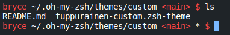

# tuppurainen-custom.zsh-theme

This is a collection of my custom themes for oh-my-zsh simply copy it into your .oh-my-zsh/themes/ folder and update your .zshrc theme location appropriately in that file
